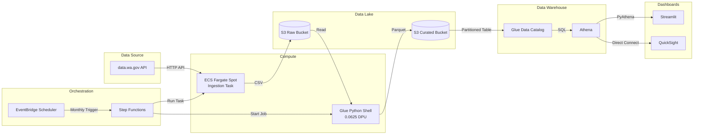
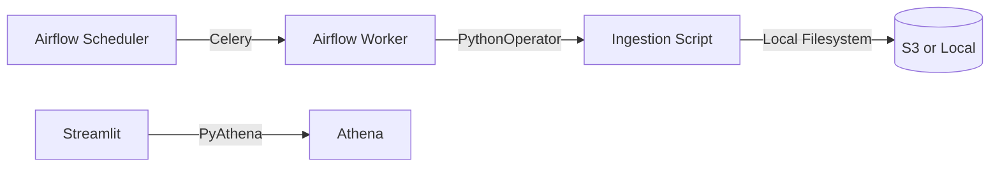
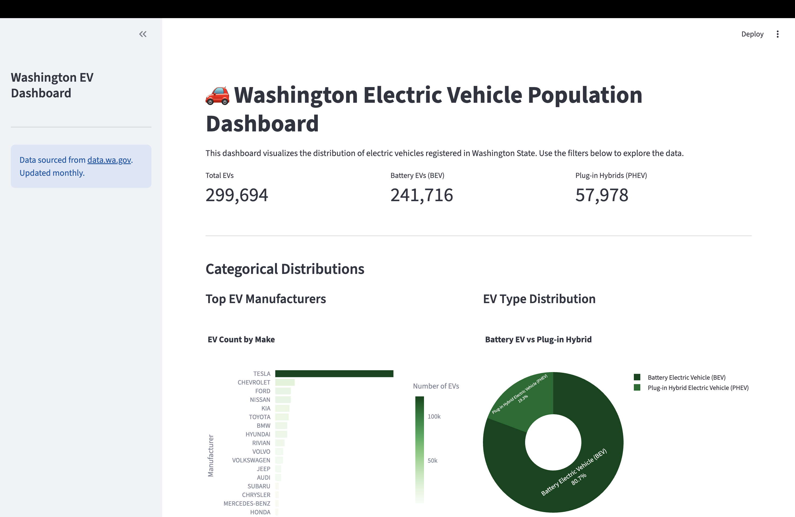

# Washington EV Population Data Pipeline

An end-to-end batch data pipeline for the [Washington State Electric Vehicle Population Dataset](https://data.wa.gov/Transportation/Electric-Vehicle-Population-Data/f6w7-q2d2). This project demonstrates modern data engineering practices using AWS serverless technologies, Terraform IaC, and dual dashboards (Streamlit + QuickSight).

---

## Table of Contents

- [Problem Description](#problem-description)
- [Architecture](#architecture)
- [Technologies Used](#technologies-used)
- [Project Structure](#project-structure)
- [Getting Started](#getting-started)
  - [Prerequisites](#prerequisites)
  - [Local Development](#local-development)
  - [AWS Deployment](#aws-deployment)
- [Data Pipeline](#data-pipeline)
- [Data Warehouse](#data-warehouse)
- [Dashboards](#dashboards)
- [Cost Optimization](#cost-optimization)
- [CI/CD](#cicd)
- [Testing](#testing)
- [Screenshots](#screenshots)
- [References](#references)

---

## Problem Description

The Washington State Department of Licensing maintains a public dataset of all electric vehicles (EVs) registered in the state. This project builds an automated pipeline that:

1. **Ingests** the latest EV registration data monthly from the SODA API
2. **Transforms** raw CSV data into a clean, partitioned Parquet format
3. **Stores** data in a data lake (S3) and exposes it via a data warehouse (Athena)
4. **Visualizes** insights through interactive dashboards

### Key Business Questions Answered

- Which EV manufacturers dominate the Washington market?
- How has EV adoption grown over time by model year?
- Where are EVs concentrated geographically by county?
- What is the split between Battery EVs (BEV) and Plug-in Hybrids (PHEV)?

---

## Architecture



### Local Development Architecture



---

## Technologies Used

| Category | Technology | Purpose |
|----------|-----------|---------|
| **Cloud** | AWS | Primary cloud provider |
| **IaC** | Terraform | Infrastructure provisioning |
| **Orchestration (AWS)** | EventBridge + Step Functions | Serverless workflow orchestration |
| **Orchestration (Local)** | Apache Airflow | Local development and testing |
| **Compute** | ECS Fargate | Containerized ingestion tasks |
| **Transformation** | AWS ECS | Data cleaning and enrichment |
| **Data Lake** | Amazon S3 | Raw and curated data storage |
| **Data Warehouse** | Athena + Glue Catalog | SQL analytics on partitioned data |
| **Dashboard** | Streamlit | Open-source Python dashboard |
| **Dashboard** | Amazon QuickSight | AWS-native BI (demo setup) |
| **CI/CD** | GitHub Actions | Lint, test, build, deploy |
| **Container** | Docker | Local Airflow + task environments |

---

## Project Structure

```
.
├── .github/workflows/          # CI/CD pipelines
├── dags/                       # Airflow DAGs (local dev)
├── docker/                     # Dockerfiles and compose
│   ├── Dockerfile              # Base task image
│   ├── Dockerfile.streamlit    # Streamlit image
│   └── docker-compose.yml      # Local Airflow + Streamlit
├── queries/                    # Validated Athena SQL queries
├── src/
│   ├── dashboard/
│   │   └── streamlit_app.py    # Streamlit dashboard
│   ├── ingestion/
│   │   └── fetch_ev_data.py    # SODA API ingestion script
│   └── transform/
│       └── glue_ev_transform.py # Glue transformation job
├── terraform/                  # Infrastructure as Code
│   ├── modules/
│   │   ├── athena/             # Athena workgroup + queries
│   │   ├── ecs/                # ECS cluster + ECR + task defs
│   │   ├── eventbridge/        # Monthly scheduler
│   │   ├── glue/               # Glue job + catalog tables
│   │   ├── iam/                # IAM roles and policies
│   │   ├── s3/                 # Data lake buckets
│   │   └── step_functions/     # Pipeline state machine
│   ├── backend.tf              # Terraform S3 backend config
│   ├── main.tf                 # Root module composition
│   ├── outputs.tf              # Terraform outputs
│   └── variables.tf            # Input variables
├── tests/                      # Unit tests
│   ├── test_ingestion.py
│   └── test_transform.py
├── .env.example                # Environment variable template
├── .gitignore
├── Makefile                    # Common commands
├── requirements.txt            # Python dependencies
└── README.md                   # This file
```

---

## Getting Started

### Prerequisites

- **Docker & Docker Compose**
- **Python 3.11+**
- **AWS CLI** configured with credentials
- **Terraform 1.5+**
- **Make** (optional, for convenience commands)

### Local Development

1. **Clone the repository**

   ```bash
   git clone https://github.com/yourusername/wa-ev-aws-pipeline.git
   cd wa-ev-aws-pipeline
   ```

2. **Set up environment variables**

   ```bash
   cp .env.example .env
   # Edit .env with your AWS credentials and bucket names
   ```

3. **Start local Airflow and Streamlit**

   ```bash
   make up
   # Or manually:
   # export AIRFLOW_UID=$(id -u)
   # docker compose -f docker/docker-compose.yml up -d --build
   ```

4. **Access the services**

   | Service | URL | Credentials |
   |---------|-----|-------------|
   | Airflow UI | http://localhost:8080 | `airflow` / `airflow` |
   | Streamlit | http://localhost:8501 | N/A |

5. **Trigger the DAG**

   - Open Airflow UI
   - Enable and trigger the `wa_ev_pipeline` DAG
   - Verify ingestion completes and data appears in S3

6. **Stop local environment**

   ```bash
   make down
   ```

### AWS Deployment

1. **Create Terraform backend resources** (one-time setup)

   ```bash
   aws s3 mb s3://wa-ev-tf-state --region us-east-1
   aws dynamodb create-table \
     --table-name wa-ev-tf-locks \
     --attribute-definitions AttributeName=LockID,AttributeType=S \
     --key-schema AttributeName=LockID,KeyType=HASH \
     --billing-mode PAY_PER_REQUEST \
     --region us-east-1
   ```

2. **Build and push Docker image to ECR**

   ```bash
   make build
   # Tag and push to ECR (see terraform output for repository URL)
   ```

3. **Deploy infrastructure**

   ```bash
   cd terraform
   terraform init
   terraform plan
   terraform apply
   ```

4. **Upload Glue script to S3**

   ```bash
   aws s3 cp src/transform/glue_ev_transform.py \
     s3://wa-ev-raw-data/glue-scripts/glue_ev_transform.py
   ```

5. **Trigger the pipeline manually**

   ```bash
   make run-aws
   # Or via AWS CLI:
   # aws stepfunctions start-execution \
   #   --state-machine-arn $(cd terraform && terraform output -raw step_functions_arn) \
   #   --name manual-$(date +%s)
   ```

6. **Verify in AWS Console**

   - Step Functions: Check execution status
   - ECS: Verify Fargate task completed
   - Glue: Confirm job run succeeded
   - Athena: Run queries against `wa_ev_db.curated_ev_data`

---

## Data Pipeline

### Ingestion (ECS Fargate Spot)

The ingestion task:
- Fetches data from `data.wa.gov` SODA API with pagination
- Handles API failures with retries
- Uploads CSV to `s3://wa-ev-raw-data/ingest_date=YYYY-MM-DD/ev_data.csv`

### Transformation (ECS Container)

The ECS runs:
- Reads raw CSV from S3 using `awswrangler`
- Renames columns to snake_case
- Casts data types (`model_year`, `electric_range`, `base_msrp` to integers)
- Derives `is_bev` flag and `vehicle_age`
- Standardizes CAFV eligibility categories
- Drops rows with missing partition keys (`model_year`, `county`)
- Writes partitioned Parquet to `s3://wa-ev-curated-data/model_year=YYYY/county=NAME/`
- Updates Glue Catalog automatically

### Orchestration (Step Functions)

State machine flow:
1. `IngestEVData` → Run ECS Fargate Spot task
2. `CheckIngestionResult` → Choice state (success/fail)
3. `RunGlueTransform` → Start E run
4. `PipelineSuccess` / `PipelineFailed`

Triggered monthly by EventBridge Scheduler (`cron(0 8 1 * ? *)`).

---

## Data Warehouse

### Partitioning Strategy

The `curated_ev_data` table is partitioned by:
- **`model_year`** (string): Optimizes temporal queries and time-series dashboards
- **`county`** (string): Optimizes geographic filtering and county-level analysis

This partitioning aligns with the primary dashboard filters and minimizes Athena scan costs.

### Table Schema

| Column | Type | Description |
|--------|------|-------------|
| vin_prefix | string | First 10 characters of VIN |
| county | string | Registration county (partition key) |
| city | string | Registration city |
| state | string | State (WA) |
| postal_code | string | ZIP code |
| model_year | bigint | Vehicle model year (partition key) |
| make | string | Vehicle manufacturer |
| model | string | Vehicle model |
| ev_type | string | BEV or PHEV |
| cafv_eligibility | string | Original CAFV status |
| electric_range | bigint | EPA electric range (miles) |
| base_msrp | bigint | Manufacturer suggested retail price |
| is_bev | boolean | True if Battery Electric Vehicle |
| vehicle_age | bigint | Current year - model year |
| cafv_eligibility_clean | string | Standardized CAFV status |

---

## Dashboards

### Streamlit (Primary)

Accessible locally at `http://localhost:8501` or deployed on-demand to ECS Fargate Spot.

**Tiles:**
1. **Categorical**: Horizontal bar chart — "Top EV Manufacturers"
2. **Temporal**: Line chart — "EV Registrations by Model Year"

**Additional visualizations:**
- EV Type Distribution (donut chart)
- Top Counties by EV Count (bar chart)
- Summary metrics cards (Total EVs, BEV count, PHEV count)

### QuickSight (Demo)

- Connects directly to Athena `curated_ev_data`
- Replicates the same two core tiles
- **Cost note**: ~$24/month for Standard author. Recommended for one-time demo; capture screenshots and pause subscription.

### Estimated Monthly Cost

| Service | Cost |
|---------|------|
| S3 (50 GB) | ~$1.15 |
| EventBridge Scheduler | Free tier |
| Step Functions | ~$0.001 |
| ECS Fargate (~5 min) | ~$0.01 |
| Athena | ~$0.01 |
| CloudWatch Logs | ~$0.10 |
| **Total per month** | **~$1.50** |

---

## CI/CD

GitHub Actions workflow (`.github/workflows/deploy.yml`):

1. **Lint & Test**: Ruff linting, Black format check, pytest
2. **Build & Push**: Docker image to Amazon ECR
3. **Terraform Deploy**: `terraform apply` on merge to `main`

Requires AWS OIDC federation configured in repository secrets (`AWS_ROLE_ARN`).

The Terraform IAM module creates the GitHub Actions OIDC provider and a role
trusted only by the configured repository and branch (`github_repository` and
`github_branch` Terraform variables). Bootstrap Terraform once using credentials
that can create IAM roles and an OIDC provider, then copy
`terraform output -raw github_actions_role_arn` into the repository's
**Settings > Secrets and variables > Actions** as `AWS_ROLE_ARN`. The role uses
`PowerUserAccess` for infrastructure deployment and grants IAM management only
for roles prefixed with the project name; role passing is restricted to the
pipeline's AWS services.

---

## Testing

Run all tests locally:

```bash
make test
# Or:
# pytest tests/ -v
```

Test coverage:
- **Ingestion**: API mocking, pagination, S3 upload, error handling
- **Transformation**: Data type casting, derived fields, partition key validation, null handling

---

## Screenshots

### Streamlit Dashboard



### QuickSight Dashboard


---

## References

- [Washington EV Population Dataset](https://data.wa.gov/Transportation/Electric-Vehicle-Population-Data/f6w7-q2d2)
- [AWS Step Functions Developer Guide](https://docs.aws.amazon.com/step-functions/)
- [AWS Glue Python Shell Jobs](https://docs.aws.amazon.com/glue/latest/dg/add-job-python.html)
- [Amazon Athena Partitioning](https://docs.aws.amazon.com/athena/latest/ug/partitions.html)
- [Terraform AWS Provider](https://registry.terraform.io/providers/hashicorp/aws/latest/docs)
- [Streamlit Documentation](https://docs.streamlit.io/)

---

## License

MIT License — See [LICENSE](LICENSE) for details.

---

## Author

Muhammad Asif — [LinkedIn](https://www.linkedin.com/in/muhammad-asif-engg/) 
